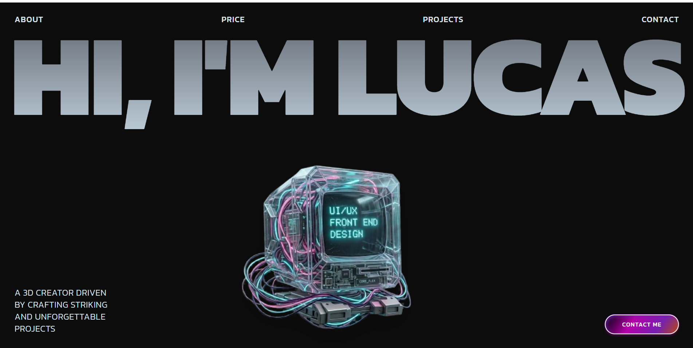

# Lucas B — Portfolio

> Personal portfolio landing page crafted with a dark, cyberpunk aesthetic — built for a **3D Creator & UI/UX Front End Designer**.



---

## Features

- Full-screen hero with viewport-scaled typography
- Magnetic cursor effect on the 3D cyberpunk computer model
- Smooth fade-in / slide-up entrance animations (Framer Motion)
- Animated marquee ticker strip
- About, Services, and Projects sections
- Responsive layout (mobile → desktop)
- Dark theme with a near-black `#0C0C0C` background

---

## Tech Stack

| Technology | Version | Role |
|---|---|---|
| [React](https://react.dev) | `^19.2.6` | UI framework |
| [TypeScript](https://www.typescriptlang.org) | `~6.0.2` | Type safety |
| [Vite](https://vite.dev) | `^8.0.12` | Build tool & dev server |
| [Tailwind CSS](https://tailwindcss.com) | `^3.4.19` | Utility-first styling |
| [Framer Motion](https://www.framer.com/motion) | `^12.40.0` | Animations & transitions |
| [Lucide React](https://lucide.dev) | `^1.17.0` | Icon library |
| [PostCSS](https://postcss.org) | `^8.5.15` | CSS processing |
| [Autoprefixer](https://github.com/postcss/autoprefixer) | `^10.5.0` | Vendor prefix automation |
| [ESLint](https://eslint.org) | `^10.3.0` | Linting |

---

## Project Structure

```
src/
├── sections/
│   ├── HeroSection.tsx       # Full-screen intro with magnetic 3D computer
│   ├── MarqueeSection.tsx    # Animated ticker strip
│   ├── AboutSection.tsx      # About me
│   ├── ServicesSection.tsx   # Services offered
│   └── ProjectsSection.tsx   # Project showcase
├── components/
│   ├── Magnet.tsx            # Magnetic cursor effect wrapper
│   ├── AnimatedText.tsx      # Text reveal animation
│   ├── FadeIn.tsx            # Fade-in scroll animation
│   ├── ContactButton.tsx     # CTA button with hover effect
│   └── LiveProjectButton.tsx # Link to live project
└── App.tsx                   # Root layout
```

---

## Getting Started

### Prerequisites

- Node.js `>=18`
- npm or pnpm

### Installation

```bash
# Clone the repository
git clone https://github.com/your-username/lucasb-portfolio.git
cd lucasb-portfolio

# Install dependencies
npm install
```

### Development

```bash
npm run dev
```

Open [http://localhost:5173](http://localhost:5173) in your browser.

### Build for Production

```bash
npm run build
```

Output goes to the `dist/` folder, ready to deploy on Vercel, Netlify, or any static host.

### Preview Production Build

```bash
npm run preview
```

---

## Scripts

| Command | Description |
|---|---|
| `npm run dev` | Start dev server with HMR |
| `npm run build` | Type-check + production build |
| `npm run preview` | Preview the production build locally |
| `npm run lint` | Run ESLint |

---

## License

Private project — all rights reserved © Lucas B.
